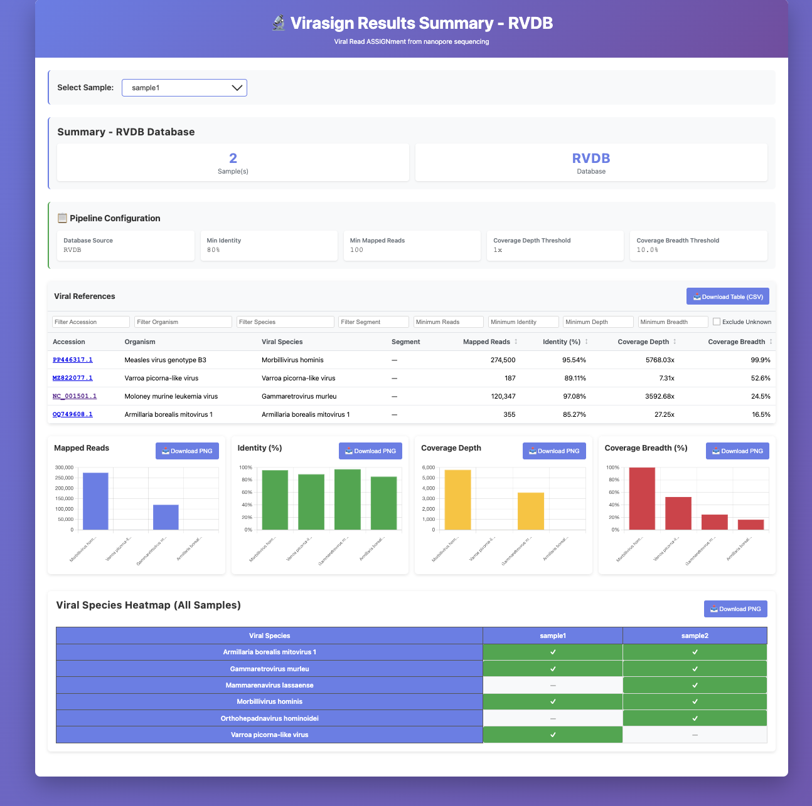

# Virasign

Virasign (**Viral** Read **ASSIGN**ment) is a viral taxonomic classification and reference selection tool for nanopore data. It maps long-read sequencing data (via minimap2) against viral databases (RVDB, RefSeq, or a custom accesion number) and performs taxonomic classification to identify viral species. Virasign generates comprehensive interactive HTML reports with filterable tables, charts and heatmaps. For each identified virus, Virasign also provides the closest reference sequence, mapped reads in FASTQ format, and BAM files which can be used to easily generate a consensus genome and visualize data (e.g., IGV). Virasign includes options to blind yourself from certain incidental findings (such as HIV, Hepatitis viruses, HTLV, EBV, CMV, HPV) when wanted, ensuring these findings do not appear in any output files, in line with consent guidelines and ethical research practices.

Virasign has been validated to classify the diversity of human pathogens well. However, when extended to other sources such as viral diversity within animal hosts, there may not be sufficient references in the databases to find good hits using this approach. In such cases, you can specify your own custom databases or accessions to improve detection.

### Why Virasign?

- **Ease of use**: Single command (`virasign -i input_dir`). Default databases (RVDB, RefSeq) are built in (no separate download), and you can run with minimal setup.
- **Clear output**: Results for each identified virus are easy to find and use (JSON summaries, per-reference FASTA/BAM/FASTQ), so you can move straight to consensus building or other preferred metagenomics pipeline steps.
- **Visualization**: Interactive HTML reports with filterable tables, charts, and heatmaps give an immediate, interpretable overview of viral species, coverage, and identity without extra scripting.
- **Blinding options**: You can blind specific viral species from all outputs (e.g. HIV, Hepatitis viruses, HTLV, EBV, CMV, HPV) so incidental findings do not appear in any files. Useful for consent guidelines and ethical research practice.

## Installation

### Prerequisites
First, install conda if you haven't already:
```bash
wget https://repo.anaconda.com/miniconda/Miniconda3-latest-Linux-x86_64.sh
bash Miniconda3-latest-Linux-x86_64.sh
```

Then, ensure you have the required channels:
```bash
conda config --add channels defaults
conda config --add channels bioconda
conda config --add channels conda-forge
```

### Option 1: Using Conda (Recommended)
Install [virasign via Conda](https://anaconda.org/bioconda/virasign):
```bash
conda create -n virasign -c bioconda virasign -y
conda activate virasign
```

### Option 2: From Source Code
1. Create and activate a new conda environment:
   ```bash
   conda create -n virasign python=3.9 -y
   conda activate virasign
   conda install -c bioconda -c conda-forge minimap2=2.24 seqtk=1.3 curl=7.88 samtools=1.17 mmseqs2=15.6f452 -y
   ```

2. Install virasign:
   ```bash
   git clone https://github.com/DaanJansen94/virasign.git  
   cd virasign
   pip install .
   ```

3. Re-installation (when updates are available):
   ```bash
   conda activate virasign  # Make sure you're in the right environment
   cd virasign
   git pull  # Get the latest updates from GitHub
   pip uninstall virasign
   pip install .
   ```
   Note: Any time you modify the code or pull updates from GitHub, you need to reinstall the package using these commands for the changes to take effect.

## Usage

First, make sure your conda environment is activated:
```bash
conda activate virasign
```

To see all available options:
```bash
virasign --help
```

### Basic Usage

```bash
# Without -o (creates Virasign_output in current directory)
virasign -i input_dir [options]

# With -o (uses specified directory)
virasign -i input_dir -o output_dir -t threads [options]
```

**Note**: The first run with Virasign may take slightly longer than subsequent runs, as it performs a one-time automatic download of the required database. The database argument (`-d/--database`) is optional and defaults to `RVDB` if not specified. The output argument (`-o/--output`) is also optional - if not specified, results will be saved to `Virasign_output/` in the current directory.

### Command-Line Options

#### Required Arguments
- `-i, --input`: Input directory containing FASTQ files

#### Optional Arguments
- `-o, --output`: Output directory for results. If not specified, creates `Virasign_output/` folder in the current directory. Use `.` to explicitly create `Virasign_output/` in current directory.

- `-d, --database`: Database name (`RefSeq`, `RVDB` (default), or accession number)
- `--rvdb-version`: RVDB database version to download (e.g., `30.0`, `31.0`, `29.0`). Default: `31.0`. Only applies when using RVDB database. See [available versions](https://rvdb.dbi.udel.edu/previous-release) for the complete list.
- `-a, --accession`: NCBI accession number(s) to download and merge with database
- `-b, --blind`: Blind specific viral species from analysis (not reported in any output files). Useful for blinding yourself from common incidental findings that require mandatory reporting (e.g., Hepatitis viruses, HIV, HTLV, EBV, CMV, HPV). Can specify abbreviations (HEP, HIV, HTLV, EBV, CMV, HPV) or full official viral species names (e.g., `'Orthohepadnavirus hominoidei'`, `'Human immunodeficiency virus'`). Multiple species can be specified comma-separated (e.g., `-b HEP,HIV,HTLV,EBV,CMV,HPV` or `-b 'Orthohepadnavirus hominoidei,Human immunodeficiency virus'`). You can mix abbreviations and full species names in the same command. Blinded species will not appear in any intermediate or final output files, ensuring complete blinding.

- `--blinding`: List all available blinding abbreviations and exit. Useful for quick reference of which viruses can be blinded using abbreviations.

- `--min_identity`: Minimum average identity percentage
- `--min_mapped_reads`: Minimum number of mapped reads (default: `100`)
- `--coverage_depth_threshold`: Minimum coverage depth threshold (default: `1.0`)
- `--coverage_breadth_threshold`: Minimum coverage breadth threshold (default: `0.1`)
- `-t, --threads`: Number of threads for minimap2 (default: `1`)
- `--enable-clustering`: Enable clustering for RVDB database (default: clustering disabled)
- `--cluster_identity`: Identity threshold for RVDB clustering (default: `0.98`, i.e., 98%). Only used if clustering is enabled with `--enable-clustering`

### Examples

```bash
# Basic usage with default RVDB database (creates Virasign_output in current directory)
virasign -i input_dir

# Basic usage with specified output directory
virasign -i input_dir -o output_dir

# Use both databases with special added accessions and 16 threads (without -o, creates Virasign_output)
virasign -i input_dir -d RVDB,RefSeq -a PX852146.1,NC_123456.1 -t 16

# Use a single accession as the database
virasign -i input_dir -d OZ254622.1 -o output_dir

# Use text file with accessions as database
virasign -i input_dir -d my_accessions.txt -o output_dir
# (my_accessions.txt contains one accession per line)

# Use text file with accessions and blind certain viruses
virasign -i input_dir -d my_accessions.txt -o output_dir -b HEP,HIV,HTLV
```

## Output Files

- **.virasign.log**: Detailed log file (hidden file, contains all processing details)
- **results_summary_*.html**: Interactive HTML reports (one per database)
- ***_final_selected_references.json**: Final curated references
- **Per-reference folders**: Each curated reference gets its own folder with:
  - **{accession}.fasta**: Reference sequence
  - **{accession}.bam**: BAM alignment file (indexed with {accession}.bam.bai)
  - **{accession}_mapped_reads.fastq**: Reads that mapped to that specific reference

## HTML Output example

Example HTML output for one sample:



## Citation

If you use Virasign in your research, please cite:

```
Jansen, D., & Vercauteren, K. (2026). Virasign: A viral taxonomic classification tool designed for nanopore sequencing data (v0.0.1). Zenodo. https://doi.org/10.5281/zenodo.18387008
```

## License

This project is licensed under the GNU General Public License v3.0 (GPL-3.0) - see the [LICENSE](LICENSE) file for details.

## Contributing

Contributions are welcome! Please feel free to submit a Pull Request.

## Support

If you encounter any problems or have questions, please open an issue on GitHub.
