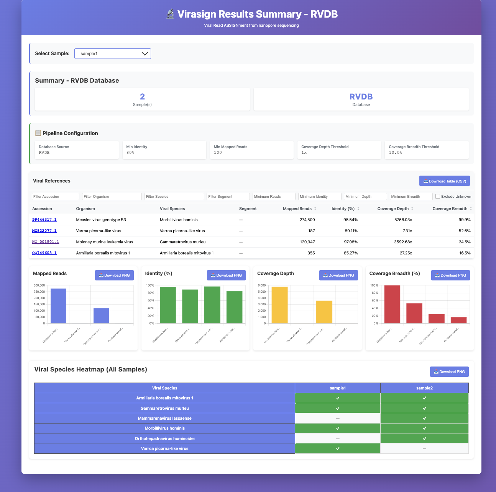

# Virasign

Virasign (**Viral** Read **ASSIGN**ment) is a viral taxonomic classification and reference selection tool for nanopore data. It maps long-read sequencing data (via minimap2) against viral databases (RVDB, RefSeq, or a custom accesion number) and performs taxonomic classification to identify viruses. Virasign generates comprehensive interactive HTML reports with filterable tables, charts and heatmaps. For each identified virus, Virasign also provides the closest reference sequence, mapped reads in FASTQ format, and BAM files which can be used to easily generate a consensus genome and visualize data (e.g., IGV). Virasign includes options to blind yourself from certain incidental findings (such as HIV, Hepatitis viruses, HTLV, EBV, CMV, HPV) when wanted, ensuring these findings do not appear in any output files, in line with consent guidelines and ethical research practices.

Virasign has been validated to classify the diversity of human pathogens well. However, when extended to other sources such as viral diversity within animal hosts, there may not be sufficient references in the databases to find good hits using this approach. In such cases, you can specify your own custom databases or accessions to improve detection.

### Why Virasign?

- **High sensitivity and specificity**: Virasign’s two-step design (map to a large viral DB, deduplicate to one best reference per virus, then remap to that curated set) gives good sensitivity and specificity and accurate per-virus read counts and BAM/FASTQ. See [Design and how Virasign works](#design-and-how-virasign-works) below.
- **Ease of use**: Single command (`virasign -i input_dir`). Default databases (RVDB, RefSeq) are built in (no separate download), and you can run with minimal setup.
- **Clear output**: Results for each identified virus are easy to find and use (JSON summaries, per-reference FASTA/BAM/FASTQ), so you can move straight to consensus building or other preferred metagenomics pipeline steps.
- **NOGR**: Virasign reports NOGR (Non-Overlapping Genomic Regions) to help interpret low-breadth hits and spot false positives such as amplicon contamination (reads accumulating in one region results in a low NOGR). See [`docs/NOGR.md`](docs/NOGR.md).
- **Visualization**: Interactive HTML reports with filterable tables, charts, and heatmaps give an immediate, interpretable overview of viral species, coverage, and identity without extra scripting.
- **Blinding options**: You can blind specific viral species from all outputs (e.g. HIV, Hepatitis viruses, HTLV, EBV, CMV, HPV) so incidental findings do not appear in any files. Useful for consent guidelines and ethical research practice.

---

## Installation

### Option 1: Using Conda (Recommended)
Install [virasign via Conda](https://anaconda.org/bioconda/virasign):
```bash
conda create -n virasign -c bioconda virasign -y
conda activate virasign
```

### Option 2: From Source Code
```bash
conda create -n virasign python=3.9 -y
conda activate virasign
conda install -c conda-forge -c bioconda minimap2=2.24 seqtk=1.3 curl "samtools>=1.17" mmseqs2=15.6f452 nextclade -y
git clone https://github.com/DaanJansen94/virasign.git
cd virasign
pip install .
```

Update to newest code (if applicable):
```bash
conda activate virasign
cd virasign
git pull
pip install .
```

---

## Database preparation (optional)

Optional download of the database(s) so you can store them in a location of interest (few GB).

- `--prepare-db`: Download/unpack/index the selected database(s) into `--db-dir`
- `-d, --database`: Which database(s) to prepare (default: `RVDB`).
- `--db-dir`: Database storage directory (default: `./Databases`).
- `--max-ambiguous-fraction`: Drop references with ≥ this fraction of Ns (default: `0.10`).
- `--rebuild`: Remove existing prepared database files and rebuild from scratch (default: off).

```bash
virasign --prepare-db -d RVDB,RefSeq --db-dir /path/to/Databases/
```

---

## Usage

First, make sure your conda environment is activated:
```bash
conda activate virasign
```

### Basic Usage

```bash
# Without -o (creates Virasign_output in current directory)
virasign -i input_dir [options]

# With -o (uses specified directory)
virasign -i input_dir -o output_dir -t threads [options]
```

---

### Command-Line Options

To see all available options:
```bash
virasign --help
```

#### Required Arguments
- `-i, --input`: A reads file (`.fastq`) or a folder of reads files.

#### Optional Arguments
- **Output**
  - `-o, --output`: Output directory (default: creates `Virasign_output/`).

- **Choose database (auto-downloads on first run)**
  - `-d, --database`: `RVDB` (default), `RefSeq`, `RVDB,RefSeq`, an accession (e.g. `OZ254622.1`), or a species name (e.g. `Orthopoxvirus monkeypox`).
  - `--rvdb-version`: Which RVDB release to download (default: `31.0`). See [available versions](https://rvdb.dbi.udel.edu/previous-release).
  - `-a, --accession`: Extra NCBI accessions to include in the run (merged with selected database).
  - `--db-dir`: Reuse an existing database folder (optional; example: `/path/to/Databases/`).

- **Viral identification thresholds (controls what is reported)**
  - `--min_identity`: Min read alignment identity (%) (default: RVDB `80`, RefSeq `95`).
  - `--min_mapped_reads`: Min read number that must map to a reference for it to be reported (default: `100`).
  - `--coverage_depth`: Min average coverage depth across the reference (default: `1.0`).
  - `--coverage_breadth`: Min fraction of the reference covered by ≥1 read (default: `0.1`).
  - `--NOGR`: Min number of Non-Overlapping Genomic Regions (default: `0`). See [`docs/NOGR.md`](docs/NOGR.md).
  - `-u, --ultrasensitive`: Lowers all thresholds to maximise detection. Useful when you suspect amplicon contamination or severe viral degeneration (bad sample storage), but not advised as default because it increases false positivity (breadth: `0.01` and depth `0.5`). 

- **Reporting**
  - `--no-html`: Disable interactive HTML report generation (default: HTML enabled).
  - `--no-gzip-fastq`: Write per-virus mapped reads as plain `.fastq` (default: `.fastq.gz`).

- **Performance**
  - `-t, --threads`: Threads used for the run (default: `1`).
  - `-r, --ram`: minimap2 memory setting in GB (default: `8`).

- **Blinding (hide specific viruses completely)**
  - `-b, --blind`: Blind specific viral species from the analysis (not reported in any output files). Use abbreviations (HEP, HIV, HTLV, EBV, CMV, HPV) or full species names (Human immunodeficiency virus, Orthohepadnavirus hominoidei).
  - `--blinding`: List available blinding abbreviations and exit.

- **Z-score (optional)**: Background-correct hits using water controls. See [`docs/Z_SCORE.md`](docs/Z_SCORE.md).
  - `--zscore`: Enable/disable Z-score computation (default: `true`, auto-detect water controls by name).
  - `--zscore-controls`: Override auto-detection with exact input paths (example: `--zscore-controls /path/water1.fastq.gz,/path/water2.fastq.gz` or `--zscore-controls water_controls.txt` with one path per line).

- **RVDB clustering (optional)**: Cluster RVDB to reduce database size and speed up runtime.
  - `--enable-clustering`: Enable clustering for RVDB (default: off).
  - `--cluster_identity`: Clustering identity (default: `0.98`; only with `--enable-clustering`).

---

### Examples

```bash
# Basic usage with default RVDB database (creates Virasign_output in current directory)
virasign -i input_dir

# Basic usage with specified output directory
virasign -i input_dir -o output_dir

# Store databases in a custom location (auto-downloads on first use)
virasign -i input_dir --db-dir /path/to/Databases/

# Use both databases with special added accessions and 16 threads (without -o, creates Virasign_output)
virasign -i input_dir -d RVDB,RefSeq -a PX852146.1,NC_123456.1 -t 16

# Use both databases with a specific RVDB version
virasign -i input_dir -d RVDB,RefSeq --rvdb-version 31.0

# Use a single accession as the database
virasign -i input_dir -d OZ254622.1 -o output_dir

# Use an organism/species-restricted database (downloads a small custom database)
virasign -i input_dir -d "Orthopoxvirus monkeypox" -o output_dir

# Use text file with species names as database
virasign -i input_dir -d species_list.txt -o output_dir
# (species_list.txt contains one species name per line)

# Use text file with accessions as database
virasign -i input_dir -d my_accessions.txt -o output_dir
# (my_accessions.txt contains one accession per line)

# Blind incidental findings of chronic viruses
virasign -i input_dir -d RVDB -b HEP,HIV,HTLV
```

---

## Output Files

| Output | Description |
|--------|-------------|
| `.virasign.log` | Detailed run log (hidden file in the output directory) |
| `results_summary_*.html` | Interactive HTML report (see example below) |
| `results_summary_*.csv` | CSV table with all identified viruses across all samples |
| `*_final_selected_references.json` | Summary per sample (metadata/stats; not the sequences themselves) |
| `NC_004296.1`, `NC_006577.2` | Per-virus folder: `NC_004296.1.fasta`, `NC_004296.1.bam`, `NC_004296.1_mapped_reads.fastq.gz`, `NC_004296.1.json` |

---

## HTML Output example



---

## Design and how Virasign works

Virasign works in two steps: **(1)** map reads to a large viral DB (e.g. RVDB, RefSeq), **(2)** pick one best reference per virus and remap all reads to that curated set.

- **Best-reference selection**: References are deduplicated per virus and one representative reference is chosen (by read count, identity, coverage), giving a small set of best refeferences instead of many near-duplicates.
- **Why remap**: In one pass to the full DB, minimap2 reports one primary alignment per read, so the best ref “wins” and other species get no count. Remapping to the curated set gives correct counts per virus and meaningful BAM/FASTQ for consensus and downstream analysis, and increases specificity (fewer spurious hits).
- **Why not secondary mapping**: Reporting multiple alignments per read in the first pass would create many false positives with a large DB and lower specificity. Virasign uses primary-only for the first pass, then deduplicates and remaps.
- **Scale and flexibility**: Large viral DBs give sensitivity and completeness (e.g. catching more true viral hits, including low-abundance or divergent viruses). Custom databases and accessions are supported, and the tool is expandable to future reference sets.

Also on [**Zenodo**](https://zenodo.org/records/18387009) and [**Docker**](https://hub.docker.com/repository/docker/daanjansen94/virasign/general).

---

## Citation

If you use Virasign in your research, please cite:

```
Jansen, D., & Vercauteren, K. (2026). Virasign: A viral taxonomic classification tool designed for nanopore sequencing data (v0.0.4). Zenodo. https://doi.org/10.5281/zenodo.18387008
```

---